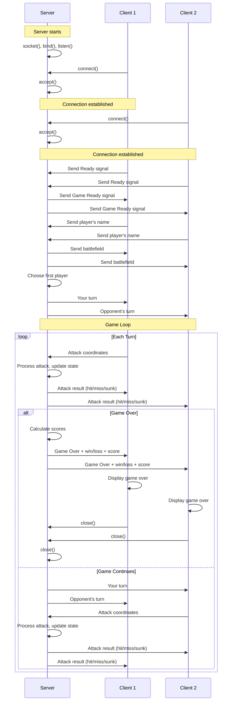

# Pacific E-Bee

Multiplayer Battleship over TCP.

## Compiling and Running

These commands will produce 2 executables inside the `src/bin/` directory: `server` and `client`.
```
cd src/
make
```

Run the server and the client in separate terminal windows. The server will wait for a client to connect.

## Game Flow

